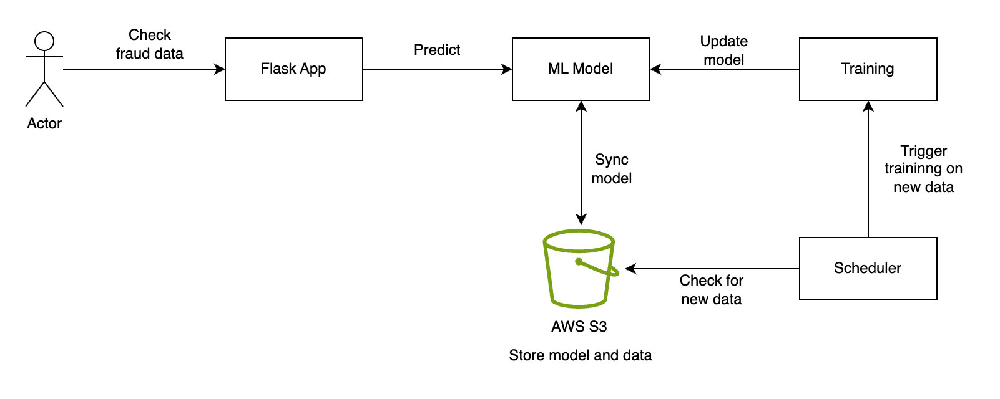

# Fraud Detection ML System

This is a Flask-based Fraud Detection ML System utilizes XGBoost for training and SMOTE for handling imbalanced data, achieving an F1 score of 0.92 on Kaggle datasets.

The system implements a mechanism to regularly check for new data in an AWS S3 bucket, retraining the model accordingly and updating it for future predictions.

### System Architect Overview

- **User Interaction**:
  - Users submit transaction data to the Flask app for fraud prediction
  - Flask preprocesses this data and uses a pre-trained ML model to determine fraud likelihood

- **Model Maintenance**:
  - A scheduler periodically checks an S3 bucket for new data
  - Upon finding new data, the system triggers model retraining

- **Model Retraining**:
  - A pre-trained model is loaded and fit with new provided data 
  - Updated models are synchronized with the app's model cache and stored in the S3 bucket.

#### Key Points:

- **Efficient Predictions**:
  - Flask processes user data quickly using a pre-trained model for fraud prediction.

- **Automated Model Updates**:
  - Scheduled checks ensure the model adapts to new patterns by integrating new data.

- **Consistent Model Access**:
  - Synchronized updates maintain prediction consistency across the app and S3 bucket.

### Model Training
#### Dataset
The dataset used in this project is [Credit Card Fraud Detection Dataset from Kaggle](https://www.kaggle.com/datasets/mlg-ulb/creditcardfraud)

##### Normalization
The dataset contain features with different scales. For instance, transaction amounts range from small to large values, while time feature have different scales altogether. Differences in feature scales can bias machine learning algorithms, favoring features with larger scales. \
RobustScaler is a method used to scale features while handling outliers robustly. It is particularly beneficial in scenarios where the dataset contains outliers or extreme values, as it doesn't consider outliers when computing the scaling parameters.

##### Handling Data Imbalance
The credit card fraud dataset is imbalanced, where one class (fraudulent transactions) is significantly less common than the other (non-fraudulent transactions). This can bias machine learning models towards the majority class. \
SMOTE (Synthetic Minority Over-sampling Technique) is used to handle such imbalances by generating synthetic examples from the minority class, thereby balancing the dataset and mitigating bias in model training.

##### XGBoost
XGBoost is an efficient and scalable gradient boosting library widely used for classification tasks. It constructs an ensemble of decision trees to make predictions and incorporates regularization techniques to prevent overfitting. \
XGBoost is well-suited for this dataset due to its adeptness in capturing non-linear relationships and providing insights into feature importance.

##### F1 Score
The model achieved an F1 score of 0.92. The F1 score is a metric that considers both precision and recall, providing a balanced assessment of a model's performance, especially in scenarios with imbalanced classes.

### Project Structure

The project consists of several files and directories:

- **`app.py`**: Entry point of the Flask application.
- **`app/`**: Directory containing the application modules.
    - **`route.py`**: Defines Flask routes for the web application
    - **`model.py`**: Contains functions for model loading, saving, training, prediction
    - **`s3_utils.py`**: Provides utility functions to interact with AWS S3.
    - **`train.py`**: Includes functions for detail data preprocessing and model training.
- **`test/`**: Directory containing test files.
    - **`test_app.py`**: Test cases for the Flask application routes and functionality.

### Setup Instructions

1. **Dependencies**: Ensure all necessary dependencies are installed. You can install them via `pip` using the `requirements.txt` file.
   
2. **Environment Variables**: Set the required environment variables for AWS access (`AWS_ACCESS_KEY_ID`, `AWS_SECRET_ACCESS_KEY`, `REGION_NAME`, `S3_BUCKET_NAME`).

3. **Model and Data Setup**: Ensure that the model and required data files are available locally or in the specified S3 bucket.

### Running the Application

To start the Flask application, execute `python app.py`. This will initialize the app and start the web server.

### Functionality

- **Endpoint**: The `/detect-fraud` endpoint receives JSON data containing transaction information and predicts whether it is fraudulent or not.
- **Model Management**: The system periodically checks for new data in the S3 bucket, retrains the model, and saves the updated model back to S3.
- **Testing**: Unit tests for the application's routes and functionality are available in the `test/` directory.

### Testing

You can run the test suite using the provided test files (`test_app.py`). Execute `pytest` in the terminal to run the tests.

### Note

- This system assumes the presence of certain files (`xgboost_model.pkl`, `creditcard.csv`, etc.) locally or in the specified AWS S3 bucket. Ensure these resources are available before running the system.

For any issues or improvements, feel free to contribute or report them.